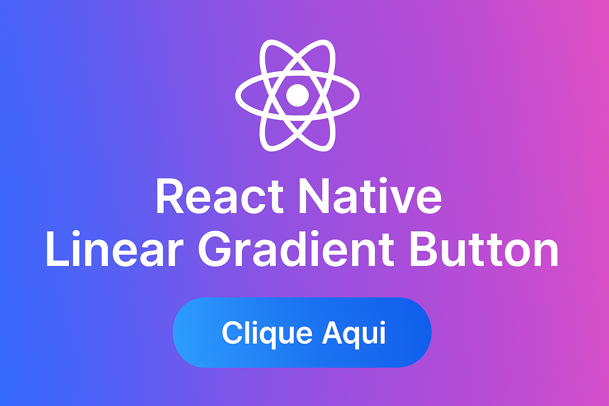

#  React Native Linear Gradient Button

This repository showcases how to create a **gradient-styled button** using the [**react-native-linear-gradient**](https://github.com/react-native-linear-gradient/react-native-linear-gradient) library. Perfect for developers looking to enhance their app's UI with a modern and professional look.

##  Advantages of `react-native-linear-gradient`

- **Easy to use:** Simple and intuitive API.
- **Cross-platform:** Works perfectly on Android and iOS.
- **Visually appealing:** Smooth and customizable gradients.
- **High performance:** Lightweight library with great performance.
- **Versatile usage:** Can be applied to buttons, cards, containers, and more.

##  Features demonstrated

- Applying linear gradient to buttons.
- Using multiple colors and controlling gradient direction.
- Integration with `TouchableOpacity` for user interaction.
- Styling using `StyleSheet`.

##  Preview



## 🚀 How to run the project

```bash
git clone https://github.com/jorgeacruz/rn-linear-gradient
cd rn-linear-gradient-button
npm install
npx pod-install # iOS only
npm run android # or npm run ios
```
## That all! Folk!!
